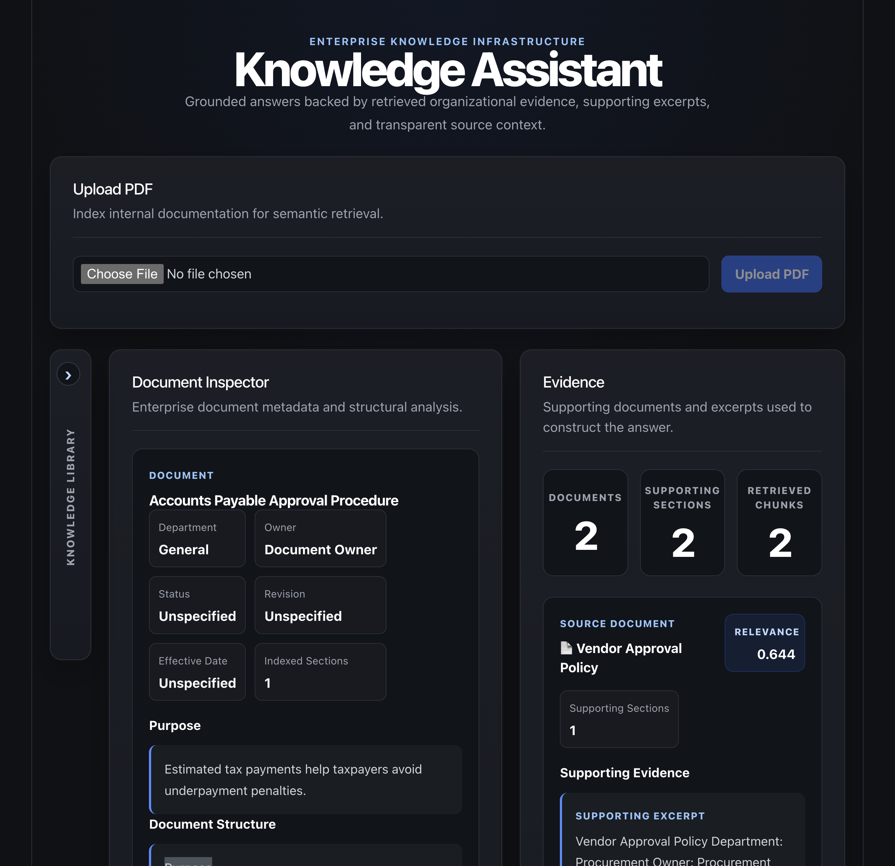
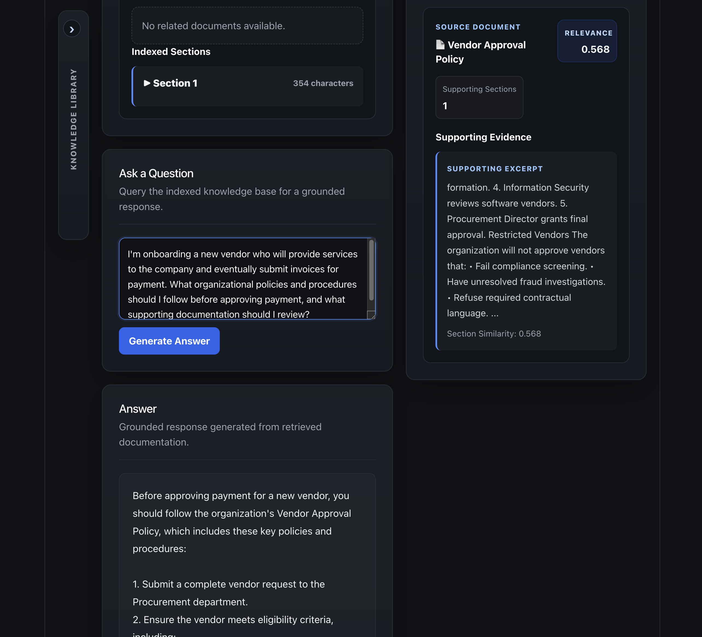
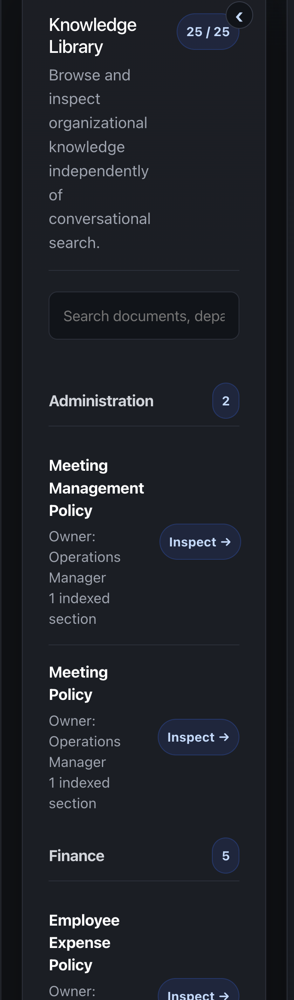
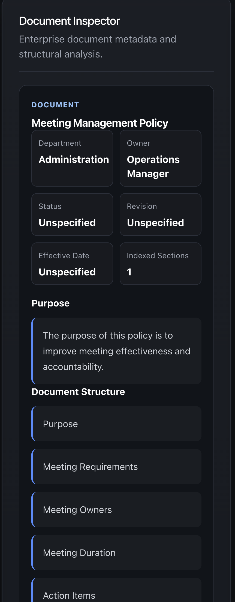
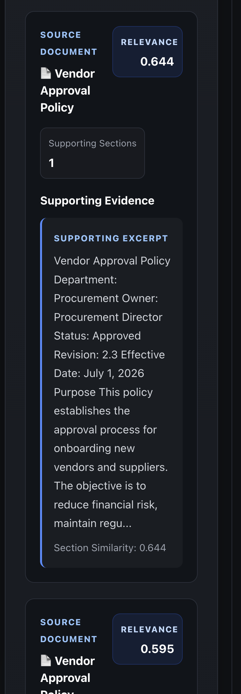

# Knowledge Assistant

> **Enterprise AI workspace for semantic retrieval, document inspection, and evidence-backed enterprise knowledge.**

---



**Built with:** React • Node.js • Express • OpenAI • Supabase • PostgreSQL • pgvector

---

## Overview

Knowledge Assistant is an enterprise AI application that helps organizations retrieve, inspect, and understand institutional knowledge stored across internal documentation.

Rather than layering a chatbot on top of enterprise documents, the application combines semantic retrieval, document inspection, metadata extraction, and evidence-backed responses into a unified workspace where organizational knowledge remains transparent, inspectable, and grounded in source material.

Instead of asking users to simply trust an AI-generated answer, Knowledge Assistant exposes the supporting evidence so users can understand both **what** the system concluded and **why** it reached that conclusion.

---

# Highlights

- Evidence-backed AI responses with transparent supporting sources
- Semantic search across enterprise documentation
- Interactive document inspection with rich metadata
- Knowledge Library for browsing organizational documents
- Relationship-aware document exploration
- Modular React and Express architecture
- OpenAI-powered semantic retrieval
- Supabase + PostgreSQL + pgvector backend

---

# Screenshots

## Enterprise Workspace



The primary workspace combines document inspection, grounded AI responses, and supporting evidence into a unified enterprise experience.

---

## Knowledge Library



Browse organizational documentation by department, search indexed content, and inspect documents independently of conversation.

---

## Document Inspector



Inspect document metadata, structure, indexed sections, and related documents without relying on AI-generated responses.

---

## Evidence Workspace



Every response includes transparent supporting evidence so users can verify conclusions against retrieved organizational knowledge.

---

# What This Project Demonstrates

This project demonstrates my approach to enterprise AI implementation.

- Building AI applications around organizational workflows rather than chat interfaces.
- Designing evidence-backed AI systems where users can inspect supporting information.
- Separating presentation, retrieval, metadata, and AI orchestration into modular services.
- Treating organizational knowledge as a durable organizational asset.
- Building software that organizations can extend and maintain over time.

---

# Why I Built This

Organizations invest enormous effort creating documentation, including:

- Standard Operating Procedures
- Policies
- Employee Handbooks
- Technical Documentation
- Process Guides
- Compliance Manuals

Unfortunately, much of that knowledge becomes difficult to discover and even harder to trust.

Many AI document assistants focus primarily on generating answers.

I wanted to explore a different approach.

Instead of hiding organizational knowledge behind a chat interface, I wanted to build a workspace where users can:

- Browse organizational knowledge
- Inspect documents independently
- Explore relationships between documents
- Review supporting evidence
- Use AI as one interface into organizational knowledge rather than the product itself

---

# Design Principles

Knowledge Assistant is built around five design principles.

### Knowledge already exists.

Organizations have already documented much of what they know.

The challenge is making that knowledge discoverable.

---

### Evidence should be visible.

Every AI response should expose the information used to generate it.

---

### Documents are durable organizational assets.

Documents remain independently inspectable regardless of how users interact with AI.

---

### Relationships matter.

Knowledge becomes more valuable when related documents can be explored together.

---

### Human judgment remains central.

The goal is not replacing organizational expertise.

The goal is supporting better decisions through transparent information.

---

# Application Flow

```text
PDF Upload
      │
      ▼
Document Processing
      │
      ▼
Semantic Indexing
      │
      ▼
Knowledge Library
      │
      ▼
Document Inspection
      │
      ▼
Evidence Retrieval
      │
      ▼
Grounded AI Response
```

---

# Features

## Document Upload

Upload enterprise PDF documentation for semantic indexing.

Current capabilities include:

- PDF parsing
- Chunk generation
- Embedding generation
- Vector storage

---

## Knowledge Library

Browse indexed documentation without asking a question.

Features include:

- Live search
- Department grouping
- Document selection
- Metadata display
- Collapsible navigation

---

## Document Inspector

Inspect enterprise documents independently of conversational retrieval.

Displays:

- Department
- Owner
- Status
- Revision
- Effective Date
- Purpose
- Document structure
- Related documents
- Indexed sections

---

## Semantic Question Answering

Ask operational questions against indexed organizational knowledge.

Responses are generated from retrieved evidence rather than unsupported reasoning.

---

## Evidence Workspace

Every AI response includes supporting evidence.

Evidence currently includes:

- Supporting documents
- Supporting excerpts
- Similarity scores
- Retrieved section counts

The application intentionally emphasizes transparency over opaque confidence metrics.

---

# Architecture

## Frontend

```text
App.jsx
│
├── UploadPanel
├── KnowledgeLibrary
├── DocumentInspector
├── QuestionPanel
├── AnswerPanel
└── EvidencePanel
```

Presentation responsibilities remain isolated while `App.jsx` coordinates application state and API communication.

---

## Backend

```text
Express API
│
├── Upload Route
├── Retrieval Route
├── Documents Route
│
├── Retrieval Service
├── Evidence Service
├── documentMetadataService
├── knowledgeRelationshipService
│
└── Supabase
      │
      └── knowledge_chunks
```

Backend responsibilities include:

- PDF ingestion
- Embedding generation
- Semantic retrieval
- Metadata extraction
- Relationship navigation
- Evidence construction
- Prompt assembly

---

# Engineering Challenges

This project explores several architectural challenges common to enterprise AI systems.

- Designing evidence-backed AI instead of opaque chat interactions.
- Separating document inspection from conversational retrieval.
- Modeling organizational documents as durable organizational assets.
- Keeping retrieval, metadata, and AI orchestration independently evolvable.
- Balancing retrieval quality with transparency and user trust.

---

# Technology Stack

### Frontend

- React
- Vite

### Backend

- Node.js
- Express

### AI

- OpenAI Embeddings
- OpenAI Chat API

### Database

- Supabase
- PostgreSQL
- pgvector

---

# Project Status

## Completed

- PDF ingestion
- Chunk generation
- Embedding generation
- Vector storage
- Semantic retrieval
- Grounded AI responses
- Evidence workspace
- Knowledge Library
- Document Inspector
- Metadata extraction
- Relationship navigation
- Modular React architecture
- Service-oriented backend architecture

---

# Roadmap

Future improvements may include:

- Enhanced document relationships
- Richer metadata extraction
- Cross-document navigation
- Improved evidence visualization
- Performance optimization

---

# Running the Project

## Install

### Frontend

```bash
cd client
npm install
```

### Backend

```bash
cd server
npm install
```

---

## Start

### Backend

```bash
cd server
npm run dev
```

### Frontend

```bash
cd client
npm run dev
```

---

# About This Project

Knowledge Assistant was built as a portfolio project exploring enterprise AI implementation, information architecture, and knowledge systems engineering.

Rather than serving as a demonstration of Retrieval-Augmented Generation (RAG) alone, the project explores how enterprise knowledge can remain transparent, inspectable, and evidence-backed. The emphasis is on information architecture, organizational knowledge, and AI-assisted retrieval rather than conversational AI alone.

---

# License

This repository is provided for portfolio and educational purposes.

Please do not redistribute substantial portions of the project without permission.

---

# Author

**Anson O'Connor**

AI Implementation & Workflow Systems Architect

Austin, Texas

**LinkedIn:** www.linkedin.com/in/ansonoconnor

**Website:** www.synapseflowsystems.com
